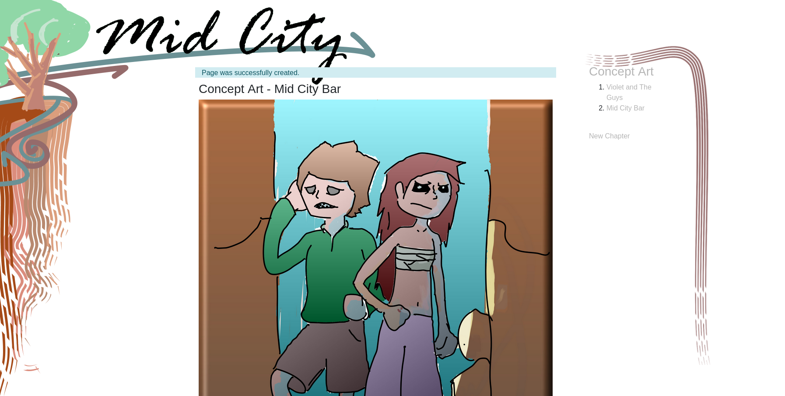
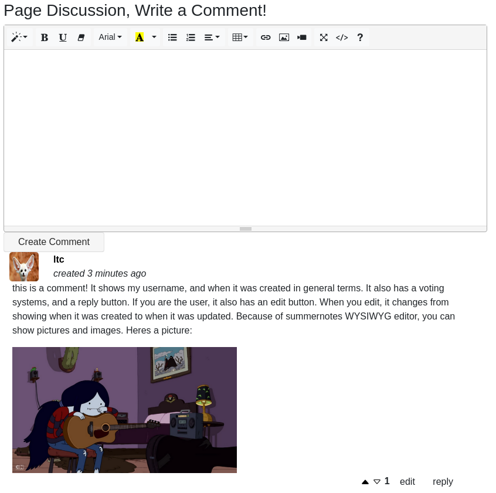
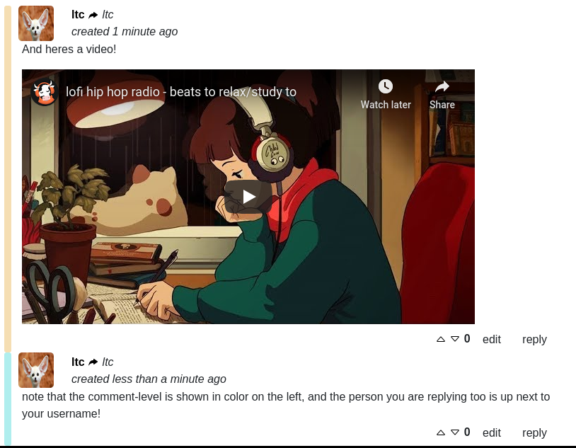

# TOONRAIL
Pet project to learn ruby on rails. The project idea is to create a website for MidCity along the lines of other web comic websites. MidCity is a future pet project I have thought about every now and again. Once the website functionality is acceptable, I plan to create a customizable site usable by any web comic creator with easy setup.

# PICTURES

# README

If there are any extra steps that had to be taken which I forgot about, or mistakes made, please edit this README.

Project Info:

* installation / setup
  1. [install rails](http://www.installrails.com/)
  2. run 'cat Gemfile | grep "apt"' in the root directory, and install the noted system files
  3. run 'bundle install' within the root directory
  4. setup the database as noted BELOW in the database creation section
  5. run 'rails server' and go to the local url.
  6. create a user.
  7. in psql, change the users role to 'admin' (UPDATE users SET role = 'admin'), no this is not ideal and I would like to put it in the credentials instead soon.
  8. is it over? Its over! Yay!

* Ruby version: 2.7

* System dependencies: look in the Gemfile for gems and system files

* Configuration: Public configuration not yet set, passwords etc currently utilizing [master.key](https://medium.com/@thorntonbrenden/rails-and-the-legendary-master-key-15c8be7799f1)

* Database creation / initialization:
  1. if you are NOT using postgres, go install needed packages and gems for yourdatabase, and then modify config/database.yml accordingly
  2. follow the installation / setup section ABOVE (yes up there) until you hit database creation.
  3. log onto postgres: run 'sudo -u postgres psql'
  4. create the databases:
      - 'CREATE DATABASE toonrail_dev;'
      - 'CREATE DATABASE toonrail_tst;'
      - 'CREATE DATABASE toonrail_prod;'
  5. sidenotes:
      - '\l' will list the databases
      - '\connect toonrail_dev' connects to the development database so you can write sql on it (aka 'SELECT * FROM pages;')
      - '\d' will list the diffrent tables in a database
  6. set a password to connect to postgres
      1. [create a postgres password](https://www.postgresqltutorial.com/postgresql-change-password/)
      2. get out of psql
      3. in the root directory run 'EDITOR="atom --wait" bin/rails credentials:edit', [more info](https://medium.com/@thorntonbrenden/rails-and-the-legendary-master-key-15c8be7799f1)
      4. set the 'database_default_password' enviroment variable used in config/database.yml. All passwords, keys, and localized configuration should be set here.
  7. autopopulate schema: 
      1. From the root directory run 'rails db:schema:load'
      2. you can check that the production database was properly set up in psql, if you like

* How to run the test suite: run 'rspec' from the project root. [Read more about rspec](https://github.com/rspec/rspec)

* Services (job queues, cache servers, search engines, etc.): will connect to google, twitter and facebook for ease of signup

* Deployment instructions: we are not there yet, but probably heroku

* Notable technologies developers may encounter
  1. [acts as commentable](https://github.com/jackdempsey/acts_as_commentable) streamlines our commenting backend code in controllers and models
  2. [acts as voteable](https://github.com/ryanto/acts_as_votable) streamlines how we vote on comments and pages
  3. [haml](https://github.com/haml/haml-rails) simplifies our view code dramatically
  4. [devise](https://github.com/heartcombo/devise) handles our authentication logic
  5. [summernote](https://summernote.org/) is our user friendly front end WYSIWYG editor
  6. [simpleform](https://github.com/heartcombo/simple_form) can be helpful in quickly writing forms
  7. [carrierwave](https://github.com/carrierwaveuploader/carrierwave) handles file uploads and downloads (especially with pictures from summernote)
  8. [rspec-rails](https://github.com/rspec/rspec-rails) and [factory-bot-rails](https://github.com/thoughtbot/factory_bot_rails) are our testing framework
  9. [sass](https://github.com/rails/sass-rails) | [+](https://sass-lang.com/), [bootstrap](https://github.com/twbs/bootstrap-rubygem) | [+](https://getbootstrap.com/docs/4.1/getting-started/introduction/), [jquery](https://github.com/rails/jquery-rails) | [+](https://api.jquery.com/category/selectors/) and [coffee-script](https://coffeescript.org/) drive our front end design.
  
